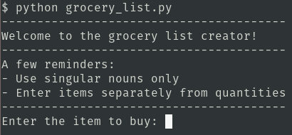
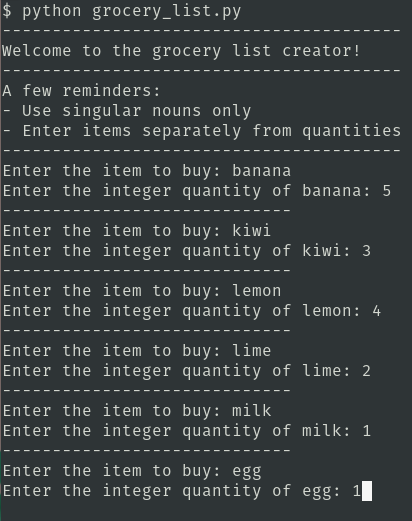
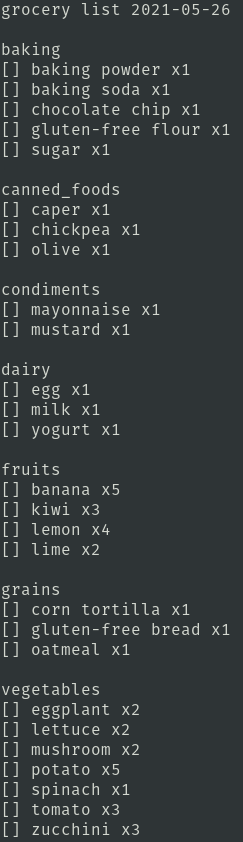
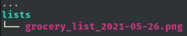
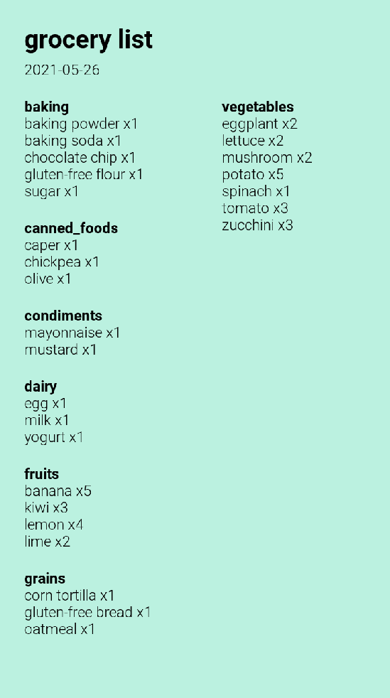

# grocery list generator

this repository contains code for **shelby's code in place 2021 final project**.  it is a python program which creates a formatted grocery list based on user input in the console.

you can view a demo of the grocery list generator [here]().

### dependencies

to use the generator yourself, you'll need:
- Python 3 installed
- the Python Imaging Library `Pillow` installed: `python -m pip install --upgrade Pillow`

### using the generator

to use the generator yourself, follow these steps:

- clone the repo: `git clone https://github.com/shelbybachman/grocery-list-generator.git`
- navigate into the directory: `cd grocery-list-generator`
- run the program: `python grocery_list.py`:

 

- when prompted, enter items and quantities
    - enter singular nouns only (e.g. `banana` rather than `bananas`)
    - enter integer quantities only
      
 

- when done entering all your items, press `Enter`
- your grocery list will be saved in two ways. first, as plain text in the console, which can be copied to list manager of your choice:
  
 

- second as an image, in the subdirectory `lists/`:

### customization

the grocery list generator has a number of customization options:

#### customize food items in the grocery database

to assign categories to food items entered, the program reads food items from files, one for each category. you can update the food items in each of the files contained in `data/*.csv`.

#### customize font family in the list image

to change the font family of the font shown on the list image, add the relevant .ttf files to the `utils/` directory. you can download font(s) of choice from [google fonts](https://fonts.google.com/). 

then, you will need to update relevant lines in the program `grocery_list.py`:
- update `FONTFILE_LIGHT` to define the font file for the date & list items (example: `'utils/Roboto-Light.ttf'`)
- update `FONTFILE_BOLD` to define the font file for the title & category names (example: `'utils/Roboto-Bold.ttf'`)